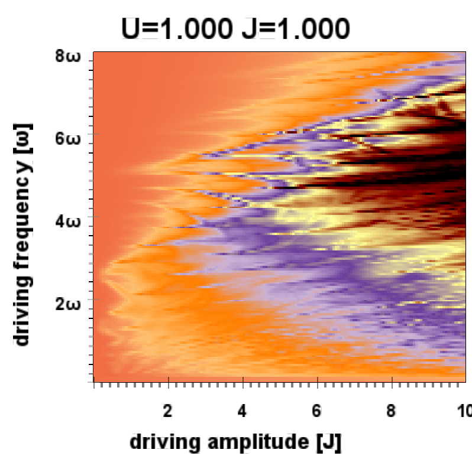

plotting experimental
=====================
to gain knowledge about opengl, glfw. only modern opengl (core profile 4.1)
is used in this library.

old experimental repositories
-----------------------------
https://github.com/keksnicoh/gl_plotting_experimental

https://github.com/keksnicoh/numeric_gravity_experimental_2

demos
-----
to document the process this repo provides some plain demo 
codes (demos/) which can be executed by python -m demos.NAME. 
each demo contains several notes about important things related
to the implementation.

images
------
first plots

some field plots

weird test plot with plotmode=oszi9

